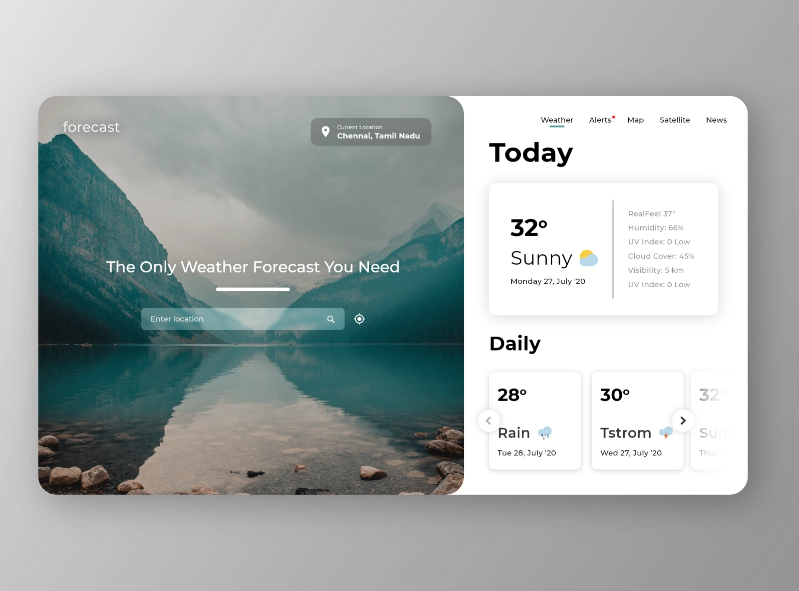

# WeatherForecast

### Task Description
The result of test task completion is a weather forecast widget.

user should have possibility:

- to see current weather forecast defined on user IP; 
- to use autocomplete for entering location (hardcoded cities);
- to enter city, if the city does not exist in hardcoded list app, the user should try to get city information from API and add it to list;
- to use browser API for geolocation detection;

### Main requirements
- UI should be implemented according to the design with pixel perfect precision;
- app should look good on mobile, tablet and desktop platforms;
- SCSS should be written with BEM methodology;
- Component-Based Architecture must be used;

### Additional requirements
 - cache implementation; - not yet done
 - usage of Angular material;

#### Recourses
WeatherForecast API:
- https://openweathermap.org/api/one-call-api
- https://openweathermap.org/current
- https://openweathermap.org/forecast16

IP Geolocation API:
- http://ip-api.com/json
 
Design:

## Development server

Run `ng serve` for a dev server. Navigate to `http://localhost:4200/`. The app will automatically reload if you change any of the source files.

## Code scaffolding

Run `ng generate component component-name` to generate a new component. You can also use `ng generate directive|pipe|service|class|guard|interface|enum|module`.

## Build

Run `ng build` to build the project. The build artifacts will be stored in the `dist/` directory.
